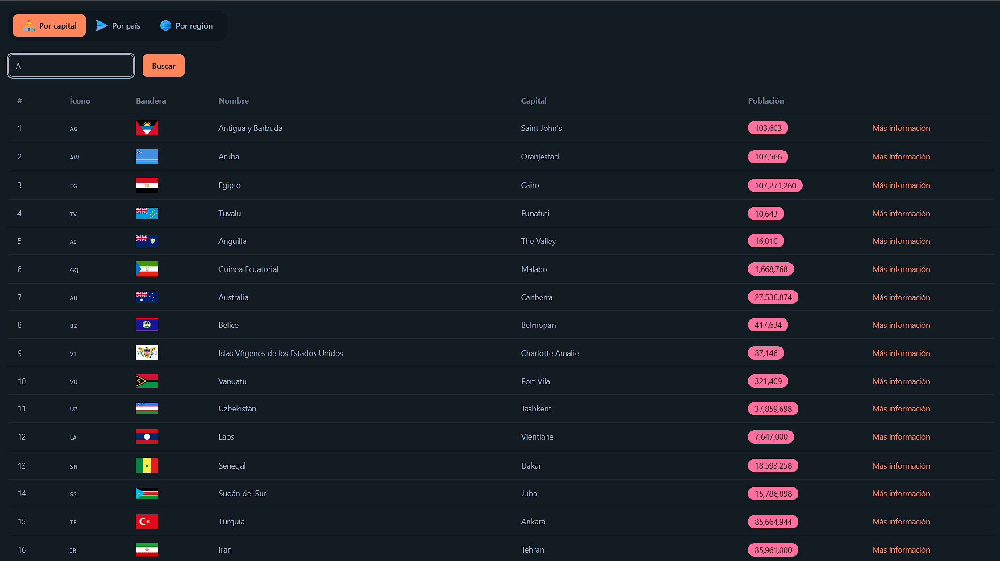
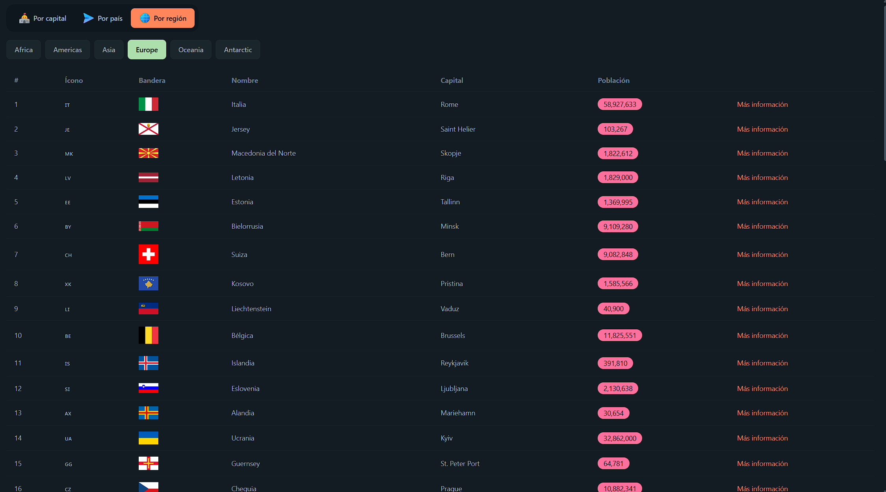
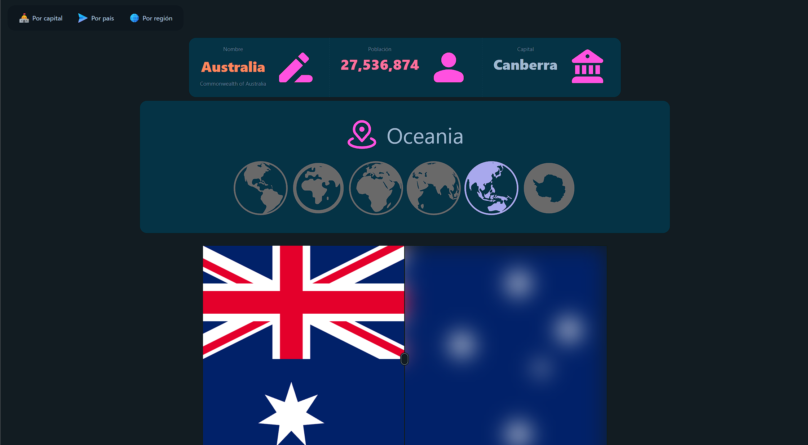

# 🌍 Country App

Aplicación web para explorar información detallada de países utilizando la API de REST Countries. Proyecto desarrollado con Angular 19 como parte de mi aprendizaje en desarrollo frontend.


## 🚀 Demo

🔗 **[Ver demo en vivo](https://dgs-country-app.netlify.app/)**

## ✨ Características

- 🔍 **Búsqueda múltiple**: Encuentra países por nombre, capital o región
- 🗺️ **Información detallada**: Visualiza datos completos de cada país
- 💾 **Persistencia de búsquedas**: El historial se mantiene al navegar
- 🎨 **Interfaz intuitiva**: Navegación fluida y moderna

## 🛠️ Tecnologías

- Angular 19
- TypeScript
- REST Countries API
- RxJS
- CSS3 / Tailwind
- Netlify (deployment)

## 📦 Instalación

1. Clona el repositorio:
```bash
git clone https://github.com/tu-usuario/country-app.git
```

2. Instala las dependencias:
```bash
cd country-app
npm install
```

3. Inicia el servidor de desarrollo:
```bash
ng serve
```

4. Abre tu navegador en `http://localhost:4200/`

## 🎯 Funcionalidades

### Búsqueda por Capital
Encuentra países introduciendo el nombre de su capital.

### Búsqueda por Nombre
Busca países directamente por su nombre oficial o común.

### Búsqueda por Región
Filtra países por regiones continentales (América, Europa, Asia, África, Oceanía).

### Vista Detallada
Al seleccionar un país, visualiza:
- Nombre
- Region
- Bandera oficial
- Población
- Capital(es)

## 📸 Screenshots

### Búsqueda por capital


### Búsqueda por región


### Detalle del país


## 🔑 API

Este proyecto utiliza la API pública de [REST Countries](https://restcountries.com/):
- Endpoint: `https://restcountries.com/v3.1/`
- No requiere API key
- Completamente gratuita

## 🎓 Aprendizajes

Este proyecto fue desarrollado como parte del curso de Angular de Udemy, donde practiqué:

- Consumo de APIs REST con HttpClient
- Manejo de Observables y RxJS
- Routing y navegación entre componentes
- Servicios e inyección de dependencias
- LocalStorage para persistencia de datos
- Buenas prácticas de desarrollo en Angular
